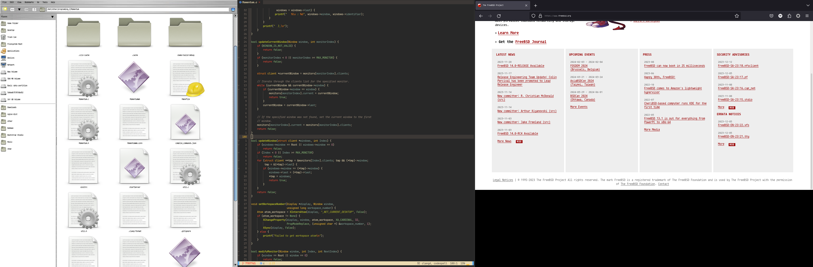

# Momentum
Momentum is a lightweight and customizable window manager for learning how to develop a window manager.

## Screenshot

## Installation
To install Momentum, clone the repository and run the installation script:

    * git clone https://github.com/masoud4/Momemum
    * cd Momentum
    * make install

## Usage
To start Momentum, run the momentum command from a terminal or use the desktop entry created during installation.

## Keybindings
Momentum comes with a default set of keybindings that you can customize in the configuration file. Some of the most commonly used keybindings are:

    * Super + R: launch a terminal
    * Super + E: launch a file manager
    * Super + P: launch dmenu_run
    * Super + Space: toggle between tiling and floating mode
    * Super + Tab: switch to the next window
    * Super + Numbers: switch to the {Number} workspace
    * Super + Shift + Numbers: move window to the {Number} workspace

## License
Momentum is licensed under the MIT License. See the LICENSE file for details.

